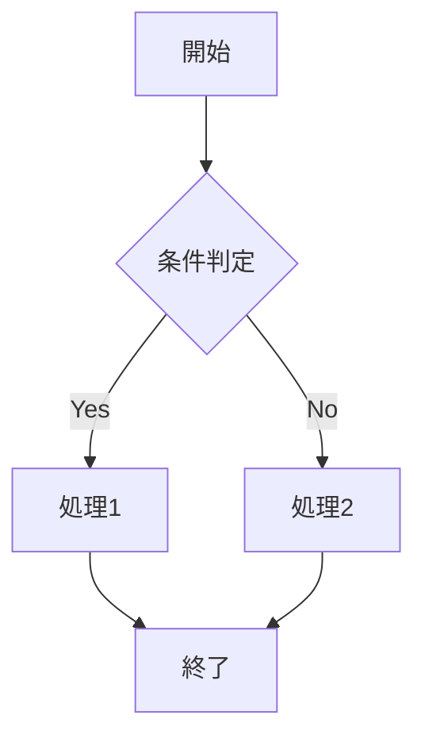
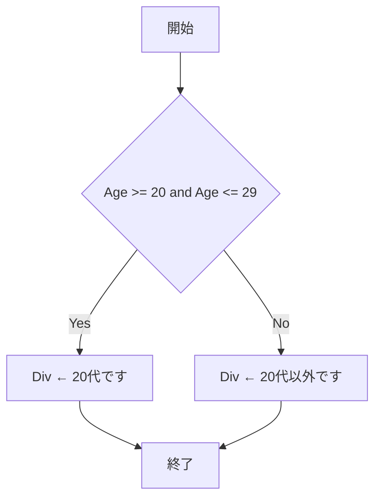
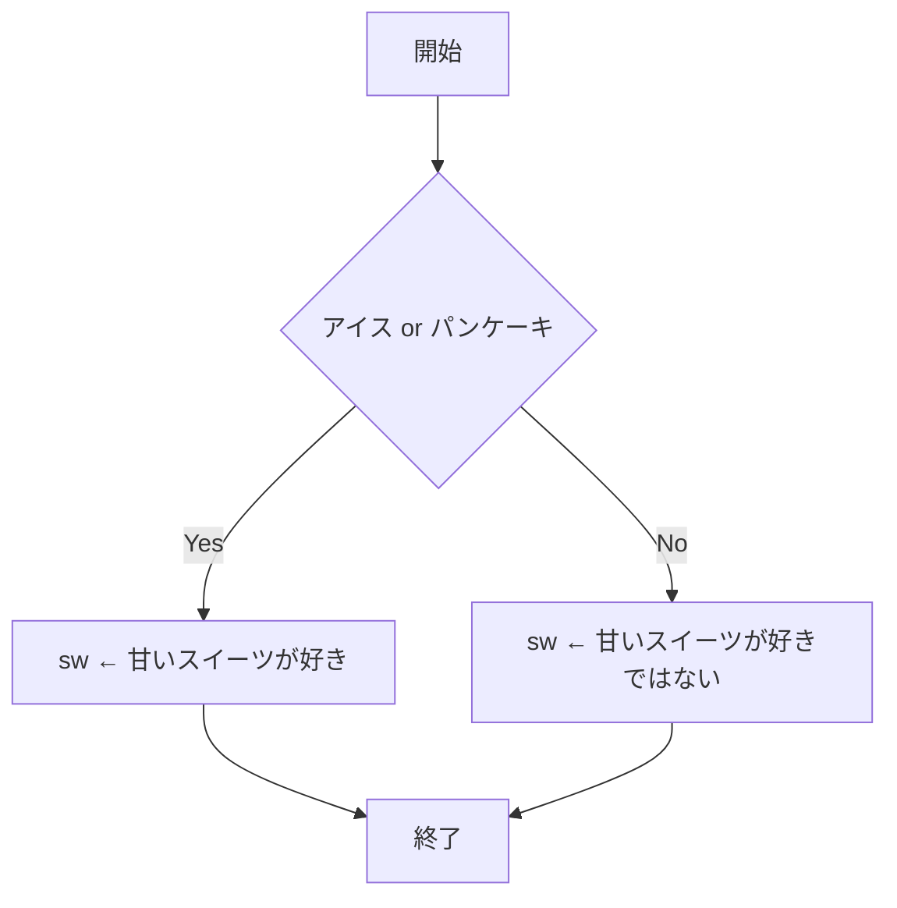
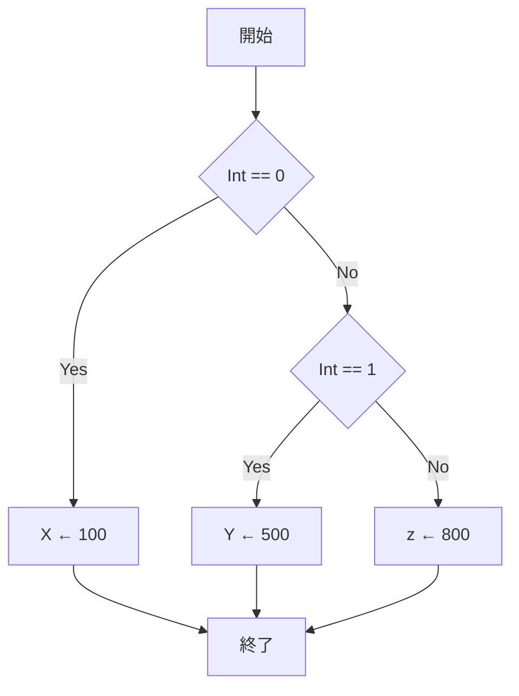

## 基本制御構造
プログラムの構造の基本となるのは
- **順次**
- **選択（分岐）**
- **繰り返し（ループ）**
の3つの制御構造で、これらを**基本制御構造**と言う
基本制御構造だけを用いて読みやすいプログラムを書く考え方を**構造化プログラム**と言う

## 分岐（選択）
条件によって実行する処理を分けることを**分岐(選択)**と呼ぶ
if文を用いる

#### if文のフローチャート

#### if文の擬似言語
```html
if(条件式)
　処理1  <!--条件が成立した時の処理-->
else
  処理2  <!--条件が成立しなかった時の処理-->
endif
```

## 複合条件、二分岐

複数の条件式を**and**や**or**で結んだもの

- andは複数の条件がすべて満たされた時だけYESへ進む、１つでも満たさなければNOへ進む

```html:andの場合
Div ← "20代以外です"
if((Age が 20 以上) and (Age が 29 以下))
  Div ← "20代です"
endif
```

- orはどれかの条件が満たされたらYESへ進む、すべて満たされていなかった場合のみNOへ進む

```html:orの場合
if((LikeFood が アイス) or (LikeFood が パンケーキ))
  sw ← "甘いスイーツが好き"
else
  sw ← "甘いスイーツが好きではない"
endif
```

## 多分岐
3つ以上に分岐先が分かれる構造を**多分岐**と呼ぶ

```html:多分岐
if(Int == 0)
　X ← 100
elseif(Int == 1)
　Y ← 500
else
　z ← 800
endifdf
```
